# Animax

A modern anime streaming application built with **Expo**, **React Native**, and **TypeScript**. Discover trending anime, browse episodes, manage your personal library, and enjoy a clean streaming experience with smooth native animations.

---

## Features

- Browse trending, latest, upcoming, and top airing anime
- Search thousands of anime instantly
- Save anime to your personal library
- Browse episodes with an interactive bottom sheet
- Built-in video player
- Resume watching from your history
- Smooth native animations
- Clean dark-themed interface

---

## Screenshots

### Home & Navigation

<table>
<tr>
<td></td>
<td>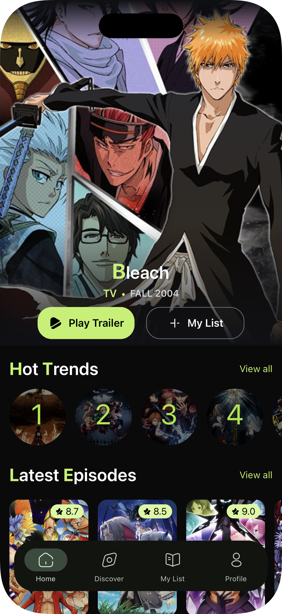</td>
<td>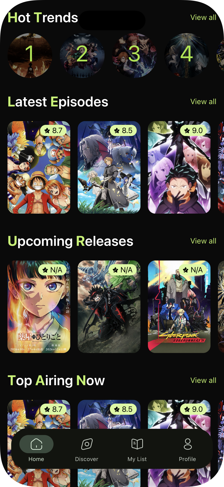</td>
<td></td>
</tr>
<tr>
<td align="center"><strong>Launch</strong></td>
<td align="center"><strong>Home (Hero)</strong></td>
<td align="center"><strong>Home (Browse)</strong></td>
<td align="center"><strong>Category Grid</strong></td>
</tr>
</table>

### Discover & Library

<table>
<tr>
<td>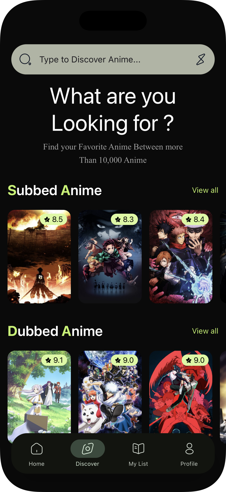</td>
<td>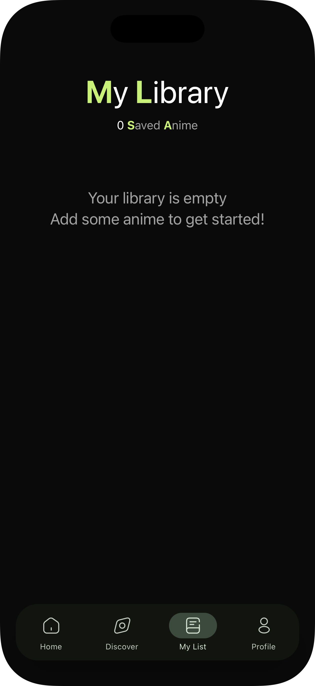</td>
<td>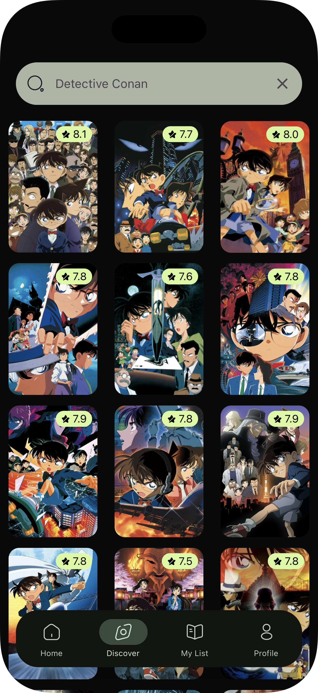</td>
<td>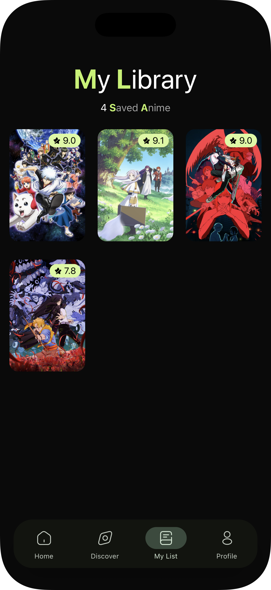</td>
</tr>
<tr>
<td align="center"><strong>Discover</strong></td>
<td align="center"><strong>Library (Empty)</strong></td>
<td align="center"><strong>Search Results</strong></td>
<td align="center"><strong>Library (Saved)</strong></td>
</tr>
</table>

### Anime Details

<table>
<tr>
<td>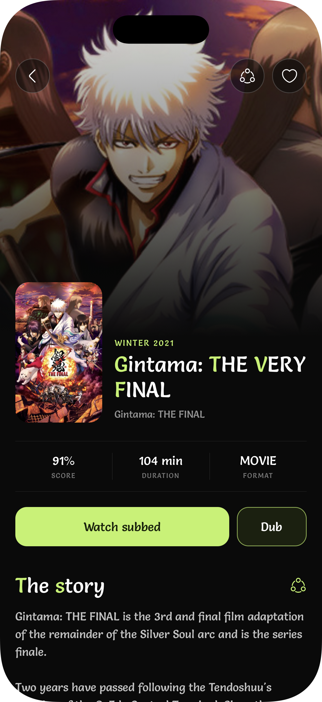</td>
<td>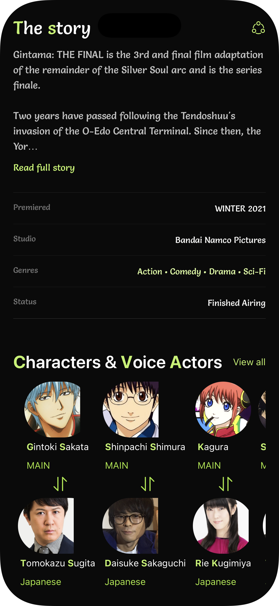</td>
<td>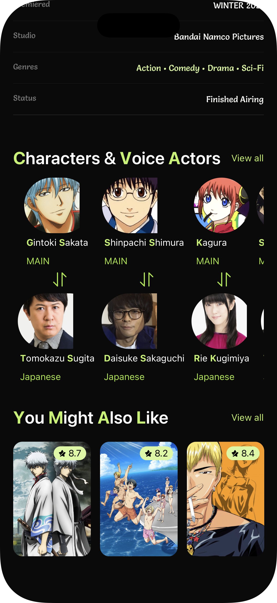</td>
<td>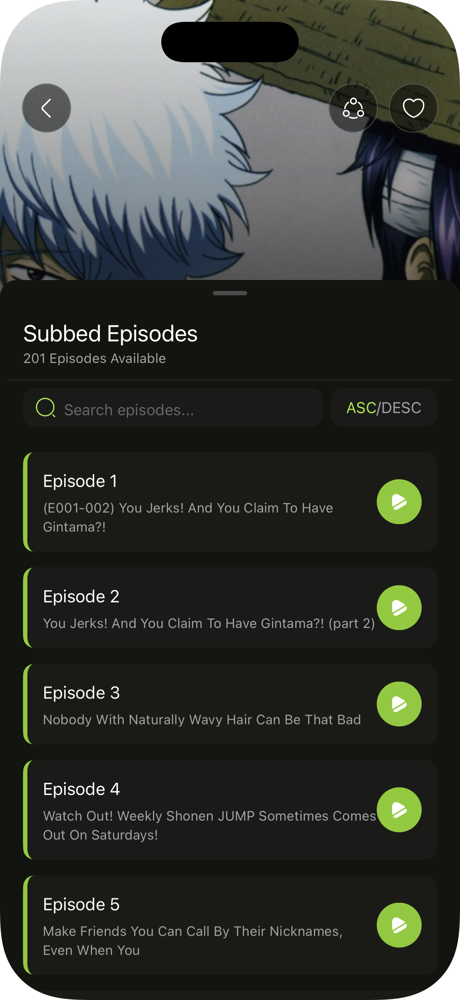</td>
</tr>
<tr>
<td align="center"><strong>Overview</strong></td>
<td align="center"><strong>Synopsis & Details</strong></td>
<td align="center"><strong>Cast & Characters</strong></td>
<td align="center"><strong>Episode Sheet</strong></td>
</tr>
</table>

### Video Streaming

<table>
<tr>
<td>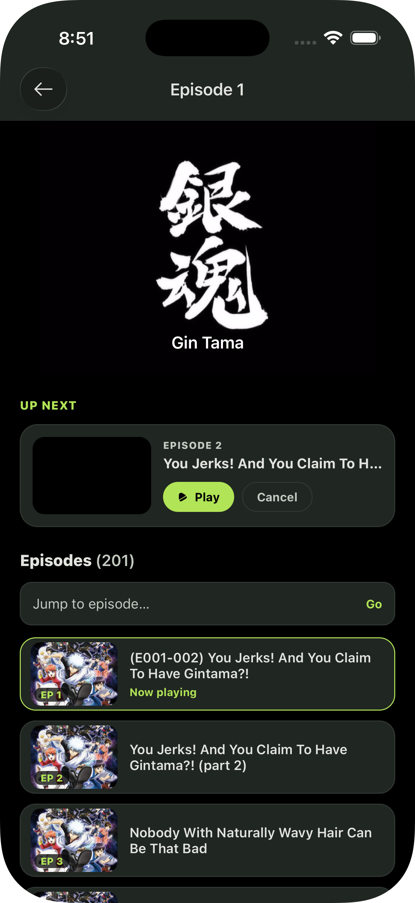</td>
<td>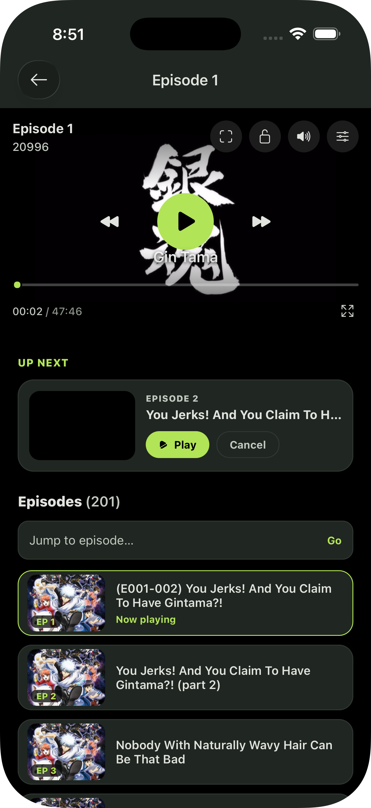</td>
</tr>
<tr>
<td align="center"><strong>Player Controls</strong></td>
<td align="center"><strong>Active Video Playback</strong></td>
</tr>
</table>

---

## Getting Started

Clone the repository.

```bash
git clone https://github.com/<your-username>/Animax.git
cd Animax
```

Install dependencies.

```bash
bun install
```

or

```bash
yarn
```

Start the development server.

```bash
bunx expo start
```

Run on Android.

```bash
bunx expo run:android
```

Run on iOS.

```bash
bunx expo run:ios
```

---

## Build

Build an Android application.

```bash
eas build --platform android
```

Build an iOS application.

```bash
eas build --platform ios
```
